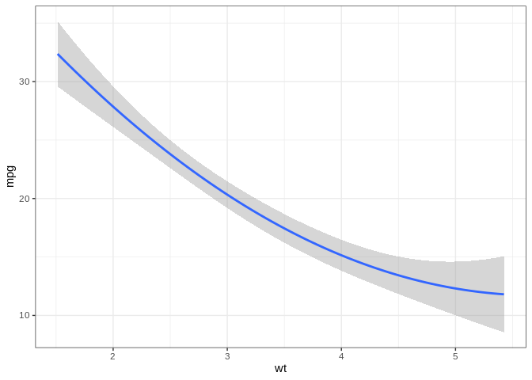

Mailbag de github
================

## En este repositorio aprenderemos sobre github

Generamos una función que se encuentra en el codigo `Funcion_Quad.R`
para que funcione deben tener instalado el paquete ggplot, si no lo han
instalado, pueden hacerlo con el siguiente código:

``` r
install.packages("ggplot2")
```

Una vez instalado este paquete puedes correr el siguiente código para
cargar la función

``` r
source("Funcion_Quad.R")
```

Una vez hecho esto esta función mostrará el gráfico del mejor ajuste de
una equación cuadrática.

Abajo pueden ver un ejemplo con `mtcars`

``` r
data("mtcars")
Plot_Quad(Data = mtcars, x = "wt", y = "mpg")
```

    ## Loading required package: ggplot2

<!-- -->
